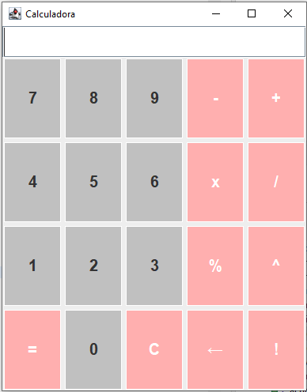

# Calculadora Java

Una calculadora simple pero funcional construida con Java Swing, que proporciona una interfaz gráfica de usuario limpia para operaciones aritméticas básicas.

## 🔍 Características

* Operaciones aritméticas básicas:
  * Suma (+)
  * Resta (-)
  * Multiplicación (*)
  * División (/)
  * Porcentaje (%)
* Función de borrado (C)
* Soporte para números negativos
* Manejo de errores para división por cero
* Interfaz amigable con colores distintivos para botones numéricos y operaciones

## 💻 Requisitos Previos

* Java Runtime Environment (JRE)
* Java Development Kit (JDK) para desarrollo

## 📖 Guía de Uso

1. Inicia la calculadora
2. Usa los botones numéricos para ingresar números
3. Selecciona una operación (+, -, *, /, %)
4. Ingresa el segundo número
5. Presiona = para ver el resultado
6. Usa C para limpiar y comenzar un nuevo cálculo
7. Para números negativos, presiona - antes de ingresar el número

## 🛠️ Detalles Técnicos

* Construido usando Java Swing para la GUI
* Implementa ActionListener para el manejo de eventos de botones
* Utiliza BorderLayout y GridLayout para la organización de componentes
* Estilización personalizada de botones con diferentes colores
* Personalización de fuentes para mejor visibilidad

## 👥 Autor

* Mayra 
* GitHub: [@tuusuario](https://github.com/mayrabpi)

---

 
